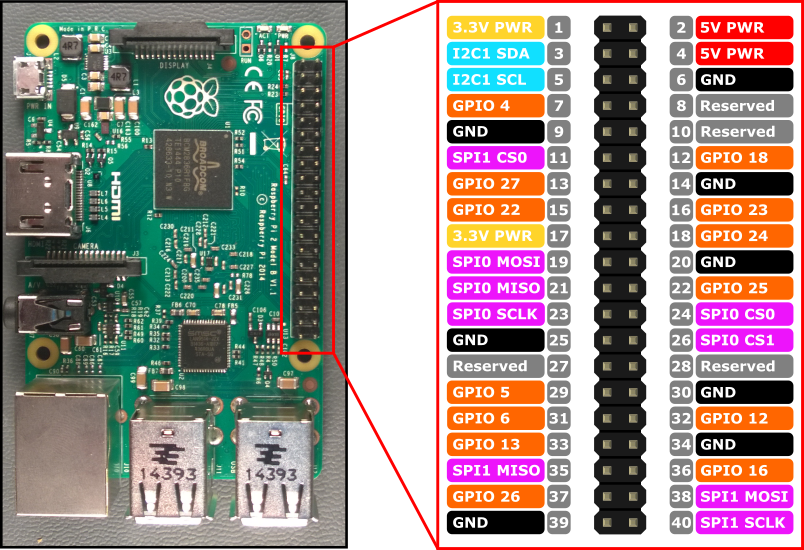

# RPI Tutorial
how to connect your Pi with your Accessories

# Compatible 

- Tested on Pi 3, P3B+, Pi zero 2W, Pi 4B

# Cài đặt

- các gói cài đặt và version từng gói [ở đây](./piplist.txt)
- dùng pip để cài đặt (python3)

# Danh sách linh kiện

- Raspberry pi 3.
- Màn TFT 1.44 inch SPI.
- Keypad 4x4.
- Servo.
- Camera raspberry 5mpx + cáp gắn.
- Cáp LAN kết nối.
- Thẻ nhớ Micro SD 16gb.
- Đầu đọc thẻ để ghi hệ điều hành vào thẻ.
- Nguồn nuôi 5v-2A.
- Dây nối.

# Connection

- [relay](./relay.md)
- [servo](./servo.md)
- [keypad](./keypad.md)
- [lcd tft 1.44inch ST7735 SPI](./tft_1.44_ST7735_SPI.md)

# Raspberry pi pinout images

- 
- 
- 