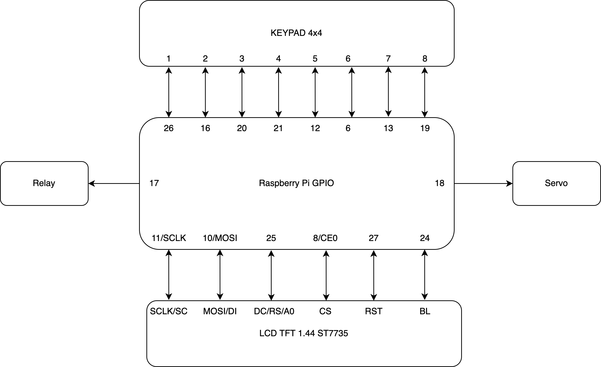
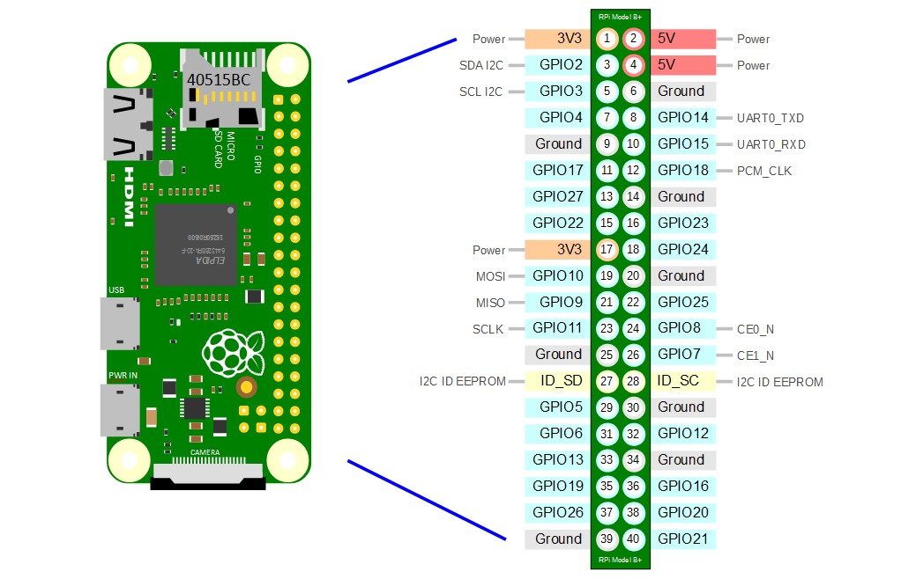

# RPI Tutorial
how to connect your Pi with your Accessories

# Compatible 

- Tested on Pi 3, P3B+, Pi zero 2W, Pi 4B

# Sơ đồ kết nối

# Phần mềm yêu cầu
 ## Windows
 - [Vscode](https://code.visualstudio.com/) dùng để kết nối ssh vào raspberry pi và code.
 - [Putty](https://www.chiark.greenend.org.uk/~sgtatham/putty/latest.html) dùng kết nối ssh cho pi
 - [Raspberry Pi Imager](https://www.raspberrypi.com/software/) Cài hệ điều hành cho raspberry
 
 ## Android hoặc IOS
 - [Ping]() Quét địa chỉ IP của con Pi trong mạng WiFi

# Các bước tiến hành

- Dùng đầu đọc thẻ gắn thẻ vào laptop
- Lên trang `raspberrypi.org` tải phần mềm `imager` về
- Cài đặt phần mềm, mở lên nhấn chọn hệ điều hành mong muốn (raspbian).
- Nhấn vào phần cài đặt phần mềm chọn điền `wifi, password, ssh` (để thiết bị tự kết nối wifi và mở ssh). Mở ssh là bắt buộc nếu không có màn hình.
- Nhấn cài đặt để cài hệ điều hành vào thẻ nhớ.
- Quá trình cài xong gắn thẻ vào trong raspberry pi. Ghim nguồn lên và đợi thiết bị tự kết nối mạng.
- Trên điện thoại tải phần mềm `Ping` để tiến hành dò tìm địa chỉ IP của thiết bị
- Mở `Command prompt` lên và ssh vào thiết bị bằng lệnh `ssh pi@IP` (`pi` là tên đăng nhập, `@` là phần phân biệt, `IP` là địa chỉ IP vừa quét được ở trên).
- Nhập mật khẩu cho thiết bị. Mật khẩu `1` (Nếu lần đầu tiên kết nối sẽ yêu cầu lưu key access (nhấn yes))
- Sau khi kết nối xong tiến hành cài đặt các gói phần mềm bên dưới để chạy code
- các gói cài đặt và version từng gói [ở đây](./piplist.txt)
- Dùng pip để cài đặt (python3)
- [tham khảo cài đặt hệ điều hành ở đây](https://projects.raspberrypi.org/en/projects/raspberry-pi-setting-up/0)

# Chương trình tự khởi động cùng hệ thống

- Tạo 1 file bash để chạy code
- Tạo 1 service để chạy file bash
- enable file service, và chạy.
- [File run code](./code/run_fast.sh). File này sẽ gọi trực tiếp tới code python
- [File service](./code/facerec.service). File này chạy file bash và khởi động cùng hệ thống.

# Lưu đồ giải thuật

- [Lưu đồ giải thuật hình ảnh](./flowchart.md)
- [Lưu đồ giải thuật draw.io](./flowchart/)

# Danh sách linh kiện

- Raspberry pi 3.
- Màn TFT 1.44 inch SPI.
- Keypad 4x4.
- Servo.
- Camera raspberry 5mpx + cáp gắn.
- Cáp LAN kết nối.
- Thẻ nhớ Micro SD 16gb.
- Đầu đọc thẻ để ghi hệ điều hành vào thẻ.
- Nguồn nuôi 5v-2A.
- Dây nối.

# Connection

- [relay](./relay.md)
- [servo](./servo.md)
- [keypad](./keypad.md)
- [lcd tft 1.44inch ST7735 SPI](./tft_1.44_ST7735_SPI.md)

# Raspberry pi pinout images

- 
- 
- 